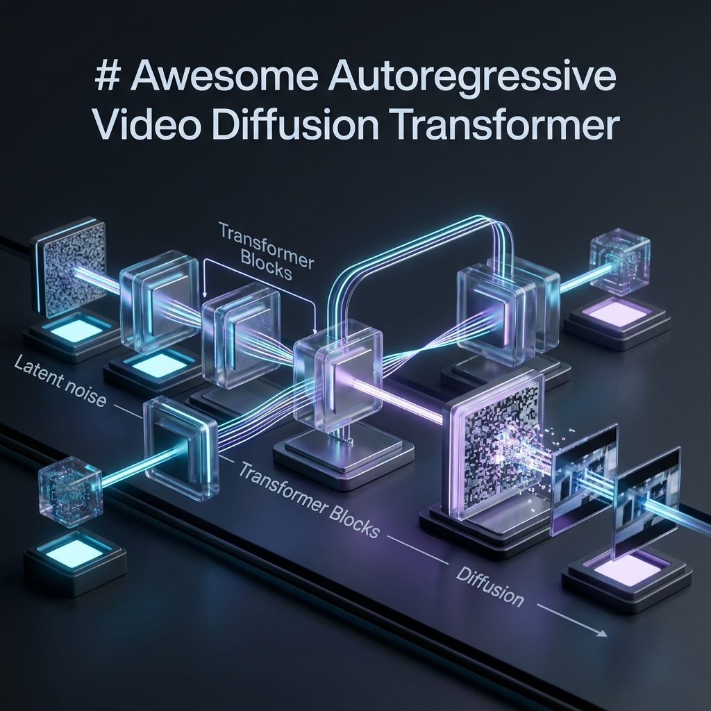

# Awesome Autoregressive Video Diffusion Transformers

[](https://github.com/sindresorhus/awesome)
[](https://opensource.org/licenses/MIT)


A curated list of **Autoregressive Video Diffusion Transformers** for video generation tasks (T2V, I2V, etc.) from top-tier computer vision and deep learning conferences and journals: **CVPR, ICCV, ECCV, NeurIPS, ICML, ICLR** along with some promising arxiv and other papers.

&gt; **Scope**: This list focuses exclusively on models that combine **autoregressive generation** with **diffusion-based denoising** in a **transformer architecture** for video generation. Pure diffusion models (e.g., Sora, CogVideoX) or pure autoregressive models without diffusion are excluded unless they explicitly bridge both paradigms.

---

---

## 📋 Table of Contents

- [2026 Papers](#2026-papers)
- [2025 Papers](#2025-papers)
- [2024 Papers](#2024-papers)
- [2023 Papers](#2023-papers)
- [2022 Papers](#2022-papers)
- [Related Resources](#related-resources)

---

## 2026 Papers

| # | Paper Title | Authors | Institute | Publisher | Paper | Code/Project | Tasks | Output |
|---|-------------|---------|-----------|-----------|-------|--------------|-------|--------|
| 45 | **Causal Forcing: Causal Autoregressive Video Diffusion** | Anonymous | Tsinghua | arXiv 2026 | [](https://arxiv.org/abs/2602.02214) | [](https://github.com/thu-ml/Causal-Forcing) | T2V, I2V | Causal, Long |
| 46 | **Helios: Real Real-Time Long Video Generation Model** | Anonymous | PKU, YuanGroup | arXiv 2026 | [](https://arxiv.org/abs/2603.04379) | [](https://github.com/PKU-YuanGroup/Helios) [](https://pku-yuangroup.github.io/Helios-Page/) | T2V | Real-time, Long |
| 47 | **Stable Video Infinity: Infinite-Length Video Generation with Error Recycling** | Anonymous | EPFL | **ICLR 2026 Oral** | [](https://arxiv.org/abs/2510.09212) | [](https://github.com/vita-epfl/Stable-Video-Infinity) | T2V | Infinite, Error-recycling |
| 48 | **LAViG-FLOW: Latent Autoregressive Video Generation with Flow-based Decoding** | Anonymous | KAUST | arXiv 2026 | [](https://arxiv.org/abs/2601.13190) | [](https://github.com/DeepWave-KAUST/LAViG-FLOW-pub) | T2V | Flow-based, Long |
| 49 | **Infinity-RoPE: Action-Controllable Infinite Video Generation Emerges From Autoregressive Self-Rollout** | Yesiltepe et al. | Virginia Tech | **CVPR 2026** | [](https://arxiv.org/abs/2511.20649) | [](https://github.com/yesiltepe-hidir/infinity-rope) | T2V | Action-controllable, Infinite |
| 50 | **Myriad: Envisioning the Future, One Step at a Time** | Baumann et al. | CompVis, MCML | **CVPR 2026** | [](https://arxiv.org/abs/2604.09527) | [](https://github.com/CompVis/flow-poke-transformer) | Interactive, I2V | Interactive, Flow-guided |
| 51 | **Time-to-Move: Training-Free Motion Controlled Video Generation via Dual-Clock Denoising** | Singer et al. | Technion, NVIDIA | **ICLR 2026** | [](https://arxiv.org/abs/2511.08633) | [](https://github.com/time-to-move/TTM) | I2V | Short, Interactive |
| 52 | **LongLive: Real-time Interactive Long Video Generation** | Yang et al. | NVIDIA, MIT | **ICLR 2026** | [](https://arxiv.org/abs/2509.22622) | [](https://github.com/NVlabs/LongLive) | T2V | Long, Action-Controllable |
| 53 | **MotionStream: Real-Time Video Generation with Interactive Motion Controls** | Shin et al. | SNU, Adobe, CMU | **ICLR 2026** | [](https://arxiv.org/abs/2511.01266) | [](https://github.com/alex4727/motionstream) | T2V | Long, Action-Controllable |
| 54 | **Reward Forcing: Efficient Streaming Video Generation with Rewarded Distribution Matching Distillation** | Lu et al. | Zhejiang University | **CVPR 2026 Highlight** | [](https://arxiv.org/abs/2512.04678) | [](https://github.com/JaydenLyh/Reward-Forcing) | T2V | Motion-guided, Long | 55 | **Rolling Forcing: Autoregressive Long Video Diffusion in Real Time** | Liu et al. | NTU | **ICLR 2026** | [](https://arxiv.org/abs/2509.25161) | [](https://github.com/TencentARC/RollingForcing) | T2V | Long, Action-Controllable |

---

## 2025 Papers

| # | Paper Title | Authors | Institute | Publisher | Paper | Code/Project | Tasks | Output |
|---|-------------|---------|-----------|-----------|-------|--------------|-------|--------|
| 1 | **End-to-End Training for Autoregressive Video Diffusion via Self-Resampling** | Huang et al. | MIT, Adobe | arXiv 2025 | [](https://arxiv.org/abs/2512.15702) | - | T2V, I2V | Long, Streaming |
| 2 | **Real-Time Motion-Controllable Autoregressive Video Diffusion** | Huang et al. | MIT, Adobe | arXiv 2025 | [](https://arxiv.org/abs/2510.08131) | - | I2V, Motion Control | Real-time, Interactive |
| 3 | **MAGI-1: Autoregressive Video Generation at Scale** | Teng et al. (Sand.ai) | Sand.ai | arXiv 2025 | [](https://arxiv.org/abs/2505.13211) | [](https://github.com/SandAI-org/MAGI-1) [](https://magi.world/) | T2V, I2V, Continuation | Long, Streaming, Cinematic |
| 4 | **AR-Diffusion: Asynchronous Video Generation with Auto-Regressive Diffusion** | Sun et al. | Tsinghua, BAAI | **CVPR 2025** | [](https://arxiv.org/abs/2503.07418) | [](https://github.com/thu-ml/AR-Diffusion) | T2V | Long, Async |
| 5 | **From Slow Bidirectional to Fast Autoregressive Video Diffusion Models** | Yin et al. | MIT, Adobe | **CVPR 2025** | [](https://arxiv.org/abs/2412.07772) | - | T2V, I2V | Fast, Streaming, Long |
| 6 | **FAR: Frame Autoregressive Model for Both Short- and Long-Context Video Modeling** | Li et al. | HKU, Tencent | arXiv 2025 | [](https://arxiv.org/abs/2503.14938) | - | T2V, I2V | Short, Long |
| 7 | **Self-Forcing: Bridging the Train-Test Gap in Autoregressive Video Diffusion** | Huang et al. | MIT, Adobe | arXiv 2025 | [](https://arxiv.org/abs/2506.08009) | - | T2V, I2V | Long, Consistent |
| 8 | **LongLive: Real-time Interactive Long Video Generation** | Yang et al. | CUHK, MMLab | arXiv 2025 | [](https://arxiv.org/abs/2509.22622) | - | T2V, Interactive | Real-time, Long, Infinite |
| 9 | **Rolling Forcing: Autoregressive Long Video Diffusion in Real Time** | Huang et al. | MIT, Adobe | arXiv 2025 | [](https://arxiv.org/abs/2509.20328) | - | T2V | Real-time, Long |
| 10 | **Autoregressive Adversarial Post-training for Real-Time Interactive Video Generation** | Lin et al. | Alibaba | arXiv 2025 | [](https://arxiv.org/abs/2506.09350) | - | T2V, I2V | Real-time, Interactive |
| 11 | **InfinityStar: Unified Spacetime Autoregressive Modeling for Visual Generation** | Liu et al. | ByteDance | arXiv 2025 | [](https://arxiv.org/abs/2511.04675) | - | T2V, I2V, Image | Long, Unified |
| 12 | **CA²-VDM: Efficient Autoregressive Video Diffusion Model with Causal Generation and Cache Sharing** | Gao et al. | NTU, Alibaba | arXiv 2024 | [](https://arxiv.org/abs/2411.16375) | - | T2V | Efficient, Long |
| 13 | **Taming Teacher Forcing for Masked Autoregressive Video Generation** | Zhou et al. | HKUST(GZ), StepFun | arXiv 2025 | [](https://arxiv.org/abs/2501.12389) | [](https://magi-video-generation.github.io/) | T2V | Long, Scalable |
| 14 | **Next Block Prediction: Video Generation via Semi-Autoregressive Modeling** | Anonymous | Anonymous | arXiv 2025 | [](https://arxiv.org/abs/2502.10666) | - | T2V | Long |

---

## 2024 Papers

| # | Paper Title | Authors | Institute | Publisher | Paper | Code/Project | Tasks | Output |
|---|-------------|---------|-----------|-----------|-------|--------------|-------|--------|
| 15 | **ARLON: Boosting Diffusion Transformers with Autoregressive Models for Long Video Generation** | Li et al. | Microsoft | **ICLR 2025** | [](https://arxiv.org/abs/2410.20502) | [](https://github.com/microsoft/Arlon) [](https://arlont2v.github.io/) | T2V | Long, Cinematic |
| 16 | **ACDiT: Interpolating Autoregressive Conditional Modeling and Diffusion Transformer** | Hu et al. | Tsinghua, ByteDance | arXiv 2024 | [](https://arxiv.org/abs/2412.07720) | - | T2V, I2V, Image | Flexible, Multi-modal |
| 17 | **DiCoDe: Diffusion-Compressed Deep Tokens for Autoregressive Video Generation with Language Models** | Li et al. | HKU, Tencent | arXiv 2024 | [](https://arxiv.org/abs/2412.04446) | [](https://github.com/liyizhuo/DiCoDe) [](https://liyizhuo.com/DiCoDe/) | T2V | Long, Scalable, Minute-level |
| 18 | **LARP: Tokenizing Videos with a Learned Autoregressive Generative Prior** | Wang et al. | UIUC | arXiv 2024 | [](https://arxiv.org/abs/2410.21264) | [](https://github.com/hywang66/LARP) [](https://hywang66.github.io/larp/) | T2V | Long |
| 19 | **ACDC: Autoregressive Coherent Multimodal Generation using Diffusion Correction** | Anonymous | Anonymous | arXiv 2024 | [](https://arxiv.org/abs/2410.04721) | [](https://acdc2025.github.io/) | T2V, Multi-modal | Coherent |
| 20 | **ART•V: Auto-Regressive Text-to-Video Generation with Diffusion Models** | Weng et al. | Microsoft | **CVPR 2024** | [](https://arxiv.org/abs/2311.18834) | [](https://github.com/WarranWeng/ART.V) [](https://warranweng.github.io/art.v/) | T2V | Keyframe-based |
| 21 | **Loong: Generating Minute-level Long Videos with Autoregressive Language Models** | Gu et al. | CUHK, MMLab | arXiv 2024 | [](https://arxiv.org/abs/2410.02757) | [](https://epiphqny.github.io/Loong-video/) | T2V | Minute-level, Long |
| 22 | **MARDiNi: Masked Autoregressive Diffusion for Video Generation at Scale** | Liu et al. | Snap, UC Berkeley | arXiv 2024 | [](https://arxiv.org/abs/2410.20280) | - | T2V | Scalable |
| 23 | **MAR: Masked Autoregressive Models for Human Motion and Video Generation** | Li et al. | Tsinghua, CUHK | arXiv 2024 | [](https://arxiv.org/abs/2411.16847) | [](https://github.com/LiJunnan123/MAR) | T2V, Motion | High-quality |
| 24 | **Progressive Autoregressive Video Diffusion Models** | Xie et al. | Adobe, UMich | **CVPR 2025** | [](https://arxiv.org/abs/2502.08159) | - | T2V | Progressive, Long |
| 25 | **FIFO-Diffusion: Generating Infinite Videos from Text without Training** | Kim et al. | KAIST, NAVER | **NeurIPS 2024** | [](https://arxiv.org/abs/2405.11473) | [](https://github.com/jeongmin-981122/FIFO-Diffusion) [](https://jjihwan.github.io/FIFO-Diffusion/) | T2V | Infinite, Training-free |
| 26 | **Diffusion Forcing: Next-token Prediction with Full-Sequence Diffusion** | Chen et al. | MIT, Stanford | **NeurIPS 2024** | [](https://arxiv.org/abs/2409.02322) | [](https://github.com/weiranwang11/diffusion-forcing) [](https://diffusion-forcing.github.io/) | T2V, Planning | Long, Consistent |
| 27 | **VideoPoet: A Large Language Model for Zero-Shot Video Generation** | Kondratyuk et al. | Google | **ICML 2024** | [](https://arxiv.org/abs/2312.14125) | [](https://sites.research.google/videopoet/) | T2V, I2V, Editing | Long, Multi-task |
| 28 | **MAGVIT-v2: Language Model Beats Diffusion -- Tokenizer is Key to Visual Generation** | Yu et al. | Google | **ICLR 2024** | [](https://arxiv.org/abs/2310.05737) | - | T2V, Image | High-fidelity |
| 29 | **Mirasol3B: A Multimodal Autoregressive model for time-aligned and contextual modalities** | de Jong et al. | Google | **CVPR 2024** | [](https://arxiv.org/abs/2311.05698) | [](https://github.com/kyegomez/Mirasol) | T2V, Multi-modal | Long-context |
| 30 | **Packing Input Frame Context in Next-Frame Prediction Models for Video Generation** | Zhang et al. | Stanford | arXiv 2025 | [](https://arxiv.org/abs/2504.12626) | - | I2V | Context-rich |
| 31 | **HiTVideo: Hierarchical Tokenizers for Enhancing Text-to-Video Generation with Autoregressive Large Language Models** | Anonymous | Anonymous | arXiv 2025 | [](https://arxiv.org/abs/2503.10677) | - | T2V | Hierarchical |

---

## 2023 Papers

| # | Paper Title | Authors | Institute | Publisher | Paper | Code/Project | Tasks | Output |
|---|-------------|---------|-----------|-----------|-------|--------------|-------|--------|
| 32 | **CogVideo: Large-scale Pretraining for Text-to-Video Generation via Transformers** | Hong et al. | Tsinghua | **ICLR 2023** | [](https://arxiv.org/abs/2205.15868) | [](https://github.com/THUDM/CogVideo) | T2V | Long, Autoregressive |
| 33 | **Phenaki: Variable Length Video Generation From Open Domain Textual Description** | Villegas et al. | Google | **ICLR 2023** | [](https://arxiv.org/abs/2210.02399) | [](https://phenaki.video/) | T2V | Variable-length, Long |
| 34 | **NUWA-Infinity: Autoregressive over Autoregressive Generation for Infinite Visual Synthesis** | Wu et al. | Microsoft | **CVPR 2022** | [](https://arxiv.org/abs/2207.09814) | [](https://github.com/microsoft/NUWA) [](https://nuwa-infinity.microsoft.com/) | T2V, I2V | Infinite, Long |
| 35 | **Make-A-Video: Text-to-Video Generation without Text-Video Data** | Singer et al. | Meta | **ICLR 2023** | [](https://arxiv.org/abs/2209.14792) | [](https://makeavideo.studio/) | T2V | Short |
| 36 | **Tell Me What Happened: Unifying Text-guided Video Completion via Multimodal Masked Video Generation** | Yan et al. | Fudan, Microsoft | **CVPR 2023** | [](https://arxiv.org/abs/2211.12824) | - | T2V, Completion | Flexible |
| 37 | **MOSO: Decomposing MOtion, Scene and Object for Video Prediction** | Sun et al. | USC | **CVPR 2023** | [](https://arxiv.org/abs/2303.03684) | [](https://github.com/iva-mzsun/MOSO) [](https://iva-mzsun.github.io/MOSO/) | Prediction | Decomposed |
| 38 | **Video Probabilistic Diffusion Models in Projected Latent Space** | Yu et al. | UC Berkeley | **CVPR 2023** | [](https://arxiv.org/abs/2302.07685) | [](https://github.com/sihyun-yu/PVDM) [](https://sihyun.me/PVDM/) | Unconditional | High-quality |
| 39 | **MeBT: Towards End-to-End Generative Modeling of Long Videos with Memory-Efficient Bidirectional Transformers** | Ge et al. | CMU | **CVPR 2023** | [](https://arxiv.org/abs/2303.11251) | [](https://github.com/Ugness/MeBT) [](https://sites.google.com/view/mebt-cvpr2023) | Long Video | Memory-efficient |
| 40 | **VIDM: Video Implicit Diffusion Models** | Wang et al. | HKUST | **AAAI 2023** | [](https://arxiv.org/abs/2212.00235) | [](https://github.com/MKFMIKU/VIDM) [](https://kfmei.page/vidm/) | T2V | High-quality |

---

## 2022 Papers

| # | Paper Title | Authors | Institute | Publisher | Paper | Code/Project | Tasks | Output |
|---|-------------|---------|-----------|-----------|-------|--------------|-------|--------|
| 41 | **Long Video Generation with Time-Agnostic VQGAN and Time-Sensitive Transformer** | Ge et al. | UMD, Adobe | **ECCV 2022** | [](https://arxiv.org/abs/2204.03638) | [](https://github.com/SongweiGe/TATS) [](https://songweige.github.io/projects/tats/index.html) | T2V | Long, Up to 30s |
| 42 | **CogVideo: Large-scale Pretraining for Text-to-Video Generation via Transformers** | Hong et al. | Tsinghua | arXiv 2022 | [](https://arxiv.org/abs/2205.15868) | [](https://github.com/THUDM/CogVideo) | T2V | Long |
| 43 | **Phenaki: Variable Length Video Generation From Open Domain Textual Description** | Villegas et al. | Google | arXiv 2022 | [](https://arxiv.org/abs/2210.02399) | [](https://phenaki.video/) | T2V | Variable-length |
| 44 | **VideoGPT: Video Generation using VQ-VAE and Transformers** | Yan et al. | UC Berkeley | arXiv 2021 | [](https://arxiv.org/abs/2104.10157) | [](https://github.com/wilson1yan/VideoGPT) [](https://wilsonyan.com/videogpt/index.html) | Unconditional | Discrete tokens |

---

## Related Resources

### Surveys & Position Papers
- **Survey of Video Diffusion Models: Foundations, Implementations, and Applications** (TMLR 2025) [](https://arxiv.org/abs/2504.16081)
- **Autoregressive Models in Vision: A Survey** (TMLR 2025) [](https://arxiv.org/abs/2411.05902)
- **A Survey on Vision Autoregressive Model** (arXiv 2024) [](https://arxiv.org/abs/2411.08666)
- **A Survey on Video Diffusion Models** (ACM CS 2024) [](https://arxiv.org/abs/2310.10647)

### Related Awesome Lists
- [Awesome Video Diffusion Models](https://github.com/ChenHsing/Awesome-Video-Diffusion-Models)
- [Awesome Diffusion Models](https://github.com/heejkoo/Awesome-Diffusion-Models)
- [Awesome Autoregressive Visual Generation](https://github.com/ChaofanTao/Autoregressive-Models-in-Vision-Survey)

---

## Citation

If you find this list helpful, please consider citing:

```bibtex
@misc{awesome-autoregressive-video-diffusion,
  title={Awesome Autoregressive Video Diffusion Transformers},
  author={Matiur Rahman Minar},
  year={2026},
  howpublished={\url{https://github.com/minar09/awesome-autoregressive-video-diffusion-transformers}}
}
